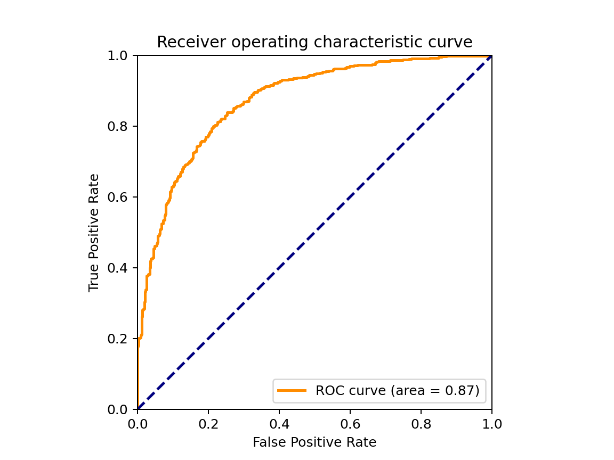

# Solution of Computer Exercise 2

This problem is a simplified problem of [Women in Data Science (WiDS) Datathon 2020](https://www.kaggle.com/competitions/widsdatathon2020) on Kaggle. It's very interesting and the method of winning team is a bit too complicated.[^1] In this article, I used 3 methods (*i.e.*, Fisher linear discriminant, perceptron and logistic regression) to help me classify two classes.

Because the methods are based on linear learning machine, we have to scale each variable (feature) by using certain method. In my case, I used `StandardScaler()` in `scikit-learn` package[^2] in Python. Its idea is to calculate $z$-score:
$$
z = (x - \mu) / \sigma
$$
where $\mu,\sigma$ is the mean and standard derivation of samples.

## Fisher linear discriminant (FLD)

Firstly, I calculate the centeroid of two classes ($m_0$ for class 0 and $m_1$ for class 1) and the between-class scatter matrix $S_w$.

Secondly, I solve $\boldsymbol{w}$ in this equation:
$$
S_w\boldsymbol{w}=\boldsymbol{m}_0-\boldsymbol{m}_1
$$
where $\det(S_w)=0$, which makes the problem much harder. But I solved it using Moore-Penrose inverse of $S_w$, *i.e.* 
$$
\boldsymbol{w}=S_w^+(\boldsymbol{m}_0-\boldsymbol{m}_1)
$$
where $S_w^+$ is the Moore-Penrose inverse of $S_w$.

The accuracy of the model for training set and test set is 0.7944 and 0.7758, respectively.

## Perceptron

I used `sklearn.linear_model.Perceptron()` for training perceptron model. I set tolerance 1e-3 and random state 42.[^3]

The cross-validation (10 folds) score (accuracy) for each fold is:

| Fold  | 1     | 2     | 3     | 4     | 5     | 6     | 7     | 8    | 9    | 10    |
| ----- | ----- | ----- | ----- | ----- | ----- | ----- | ----- | ---- | ---- | ----- |
| Score | 0.736 | 0.676 | 0.702 | 0.698 | 0.724 | 0.718 | 0.712 | 0.72 | 0.71 | 0.692 |

And the accuracy of the model for training set 1 and test set 1 is 0.755 and 0.747, respectively.

For training set 2 and test set 2, the scores are 0.999 and 0.824.

**My observations about the result of perceptron:**

If one tries different random state:

```python
clf = Perceptron(random_state, *args, **kwargs)
```

I mean one just modifies the random state parameter, he/she can see that the results differ.

For `random_state=3407`[^4], the scores for sets 1 are 0.728 and 0.710; for `random_state=0`, they are 0.691 and 0.656.

In addition, the model is not so robust when facing different training data (training set 1 - 0.747 and training set 2 - 0.824).

## Logistic regression (LR)

I used `sklearn.linear_model.LogisticRegression()` for training perceptron model. I set max iteration 1e3.

The accuracy for training set 1 and test set 1 is 0.797 and 0.788, it's not bad!

The roc curve is plotted as below:



Finally, let's take an insight of the relationship of each feature and patients' survival. I used `statsmodels` package in Python. I picked the variables whose $P(P>|z|)<0.01$. The variables are 'age', 'elective_surgery', 'pre_icu_los_days', 'bun_apache', 'gcs_motor_apache', 'hematocrit_apache', 'ventilated_apache', 'wbc_apache', 'd1_heartrate_max', 'd1_spo2_min', 'd1_temp_max', 'd1_temp_min', 'h1_heartrate_max', 'h1_mbp_min', 'h1_sysbp_min', 'd1_calcium_max', 'd1_calcium_min', 'd1_hemaglobin_max', 'd1_platelets_max', 'apache_4a_icu_death_prob', 'hepatic_failure',       'immunosuppression', 'solid_tumor_with_metastasis'. Among these variables, age, ventilated_apache and apache_4a_icu_death_prob have strong positive relationship with the death of patients while gcs_motor_apache and elective_surgery have slightly weak negative relationship. This fact is not hard to explain.

For more details, please have a check of my code in supplementary materials.

[^1]: Cohen, S., Dagan, N., Cohen-Inger, N., Ofer, D., & Rokach, L. (2021). ICU Survival Prediction Incorporating Test-Time Augmentation to Improve the Accuracy of Ensemble-Based Models. *IEEE Access*, *9*, 91584-91592.
[^2]: Pedregosa, F., Varoquaux, G., Gramfort, A., Michel, V., Thirion, B., Grisel, O., ... & Duchesnay, E. (2011). Scikit-learn: Machine learning in Python. *Journal of Machine Learning Research*, *12*, 2825-2830.
[^3]: Graham Sahagian. (2020-12-01). [What is Random State? And Why is it Always 42?](https://grsahagian.medium.com/what-is-random-state-42-d803402ee76b) Retrieved 2022-10-04. (Disclaimer: It's a joke. Please do not take it seriously.)
[^4]: Picard, D. (2021). Torch. manual_seed (3407) is all you need: On the influence of random seeds in deep learning architectures for computer vision. *arXiv preprint arXiv:2109.08203*.