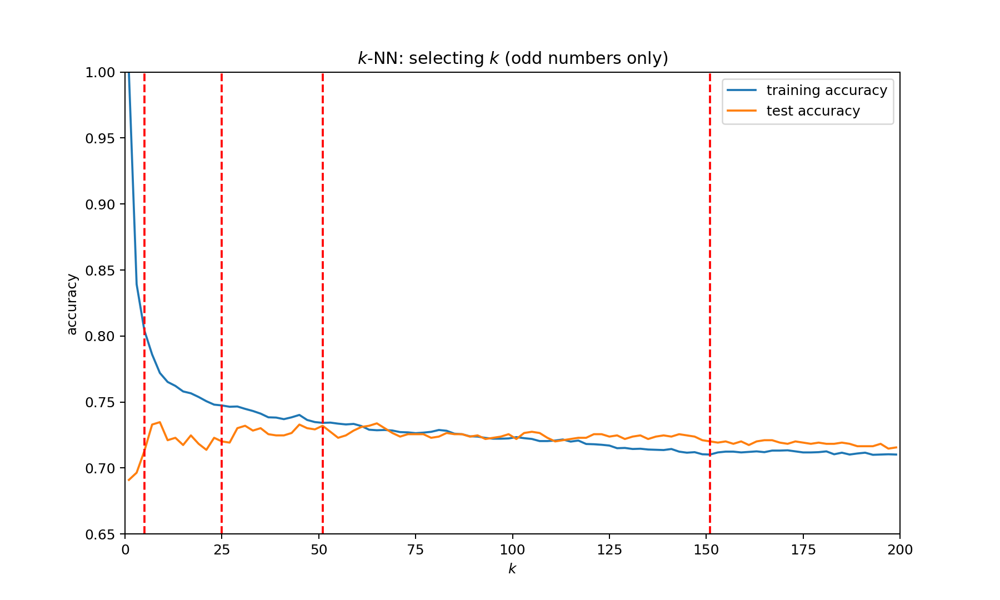
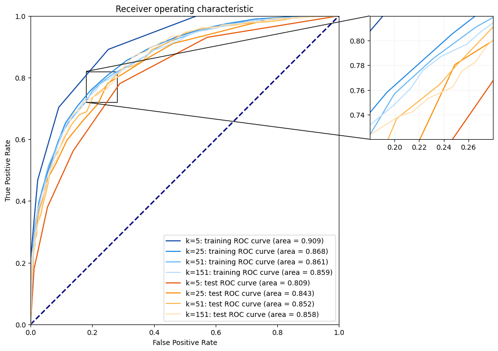
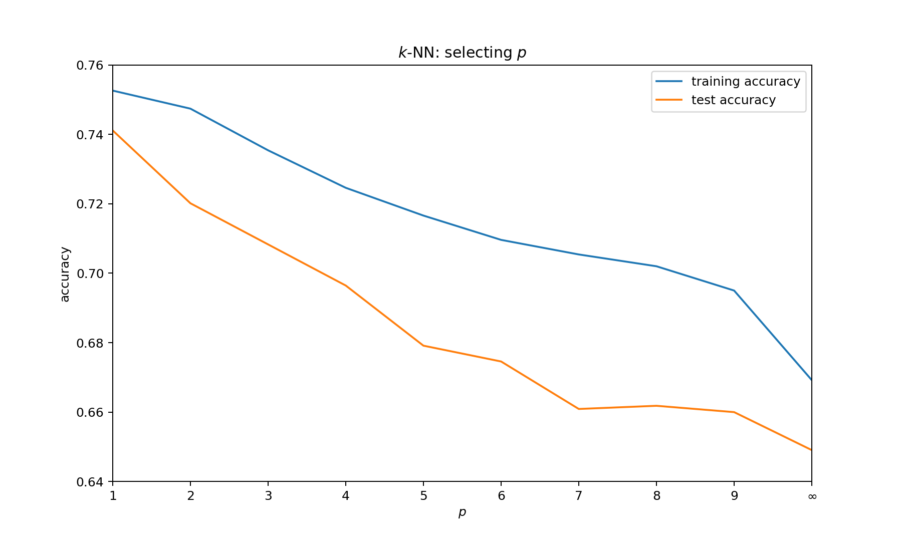
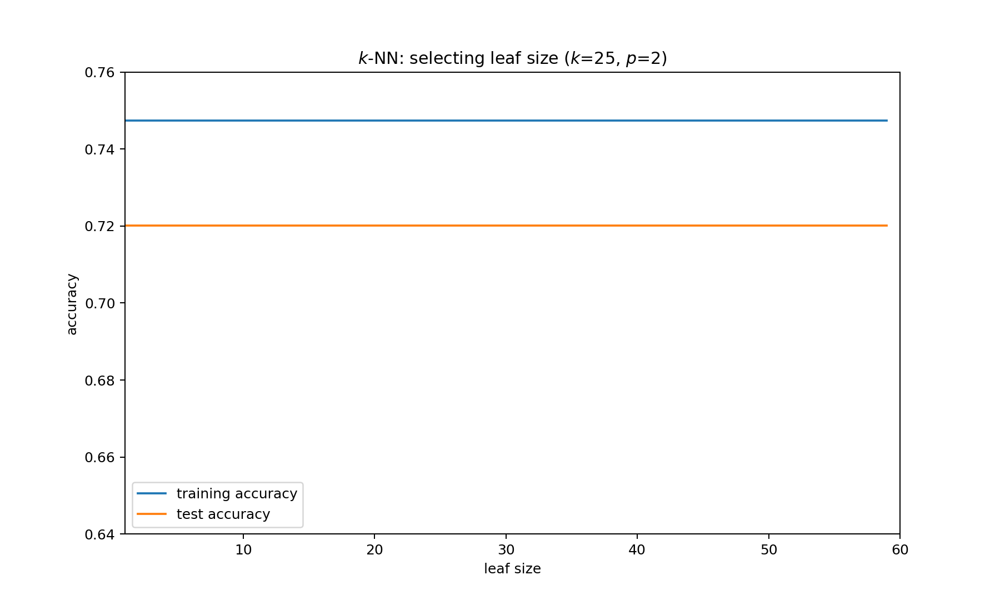

# Solutions of Computer Exercise 3

## Usage of `sklearn.neighbors.KneighborsClassifier()`

The `sklearn.neighbors.KneighborsClassifier()` function is used to classify the data points based on the nearest neighbors. The function takes the following parameters:

```python
clf = sklearn.neighbors.KNeighborsClassifier(n_neighbors=5, *, weights='uniform', algorithm='auto', leaf_size=30, p=2, metric='minkowski', metric_params=None, n_jobs=None)
```

In fact, one does not need to specify all the parameters. The default values are used if the parameters are not specified.

The `n_neighbors` parameter ($k$) specifies the number of neighbors to be considered for classification. The default value is 5.

The package use attempt to decide the most appropriate algorithm (among BallTree, KDTree and brute-force search) based on the values passed to fit method.

For other parameters we will discuss later.

## The choice of $k$ in $k$-NN algorithm (odd numbers only)

For different $k$ in `n_neighbors` in this problem, the accuracy score for training set and test set can be plotted as below:



This plot can bring us several ideas:

* When $k=0$, training accuracy is 1. (obviously)
* With the increase of $k$, training accuracy decreases and test accuracy increases and converges (not mathematically) to a certain value.

Let's set $k=5, 25, 51, 151$ and observe for training set and test set:



With the increase of $k$, the area of training accuracy decreases and area of test accuracy increases. But there is no need to set $k$ too large, because the area of test accuracy will not increase too much. In this problem, $k=25$ is a good choice.

## The choice of $p$ in $k$-NN algorithm

In $k$-NN algorithm, the distance between two points can be calculated by different metrics. In `scikit-learn`, the default metric is $L_p$ norm, which is also called Minkowski distance. The formula is:

$$
d(x, y) = \left(\sum_{i=1}^n |x_i - y_i|^p\right)^{1/p}
$$

If $p=1$, it is Manhattan distance; if $p=2$, it is Euclidean distance; if $p=\infty$, it is Chebyshev distance.

I use the same dataset as above, and set $k=25$ and $p=1, 2, \cdots, 9, \infty$ to observe the accuracy score for training set and test set:



Both scores of training set and test set decrease greatly with the increase of $p$. It's obvious that with the increase of $p$, the distance between two points becomes smaller and smaller, which means the data is less and less separable.

## Other parameters

As I mentioned previously, there are other parameters (or hyperparameters) in `scikit-learn` package. But I don't think it's necessary to explain them in detail. So I just give a brief summary.

* `weights`: the weight function used in prediction. Default is `uniform`. You can also set `distance` to weight points by the inverse of their distance. In practice, it is useful to give more weight to closer neighbors.

* `algorithm`: algorithm used to compute the nearest neighbors. Default is `auto`. It will attempt to decide the most appropriate algorithm based on the values passed to fit method. You can also set `ball_tree`, `kd_tree` or `brute` to use a BallTree, a KDTree or a brute-force search.

* `leaf_size`: leaf size passed to BallTree or KDTree. This can affect the speed of the construction and query, as well as the memory required to store the tree. The optimal value depends on the nature of the problem. Different value won't affect the result (it's just a trade-off between speed and memory).



## Postscript

I did not use even number of $k$ in this problem, because I think it is not necessary. If $k$ is even, the performance of classification model will be significantly worse than that of odd $k$ (because of the tie). 