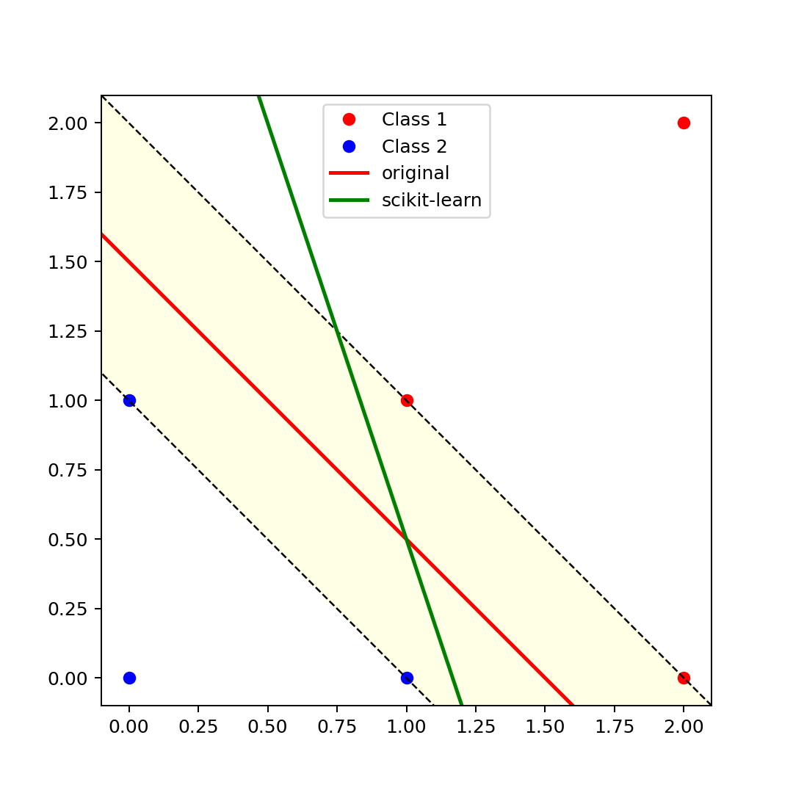

# Solutions of Problem Set 5

The 2-classes of the points can be plotted as follows:

It's obvious that

$$
\frac{2}{\Vert \boldsymbol{w}\Vert}=\frac{\sqrt{2}}{2},\quad i.e.\, \Vert \boldsymbol{w}\Vert=2\sqrt{2}.
$$

and

$$
\boldsymbol{w}^T = (2, 2), b = -3.
$$

## Solve the problem using the dual form

Although we can get $\boldsymbol{w}$ easily from the plot, we can also solve the problem using the dual form.

The dual form of the problem is

$$
\begin{aligned}
\max_{\boldsymbol{\alpha}} \quad & \sum_{i=1}^N \alpha_i - \frac{1}{2}\sum_{i=1}^N\sum_{j=1}^N \alpha_i \alpha_j y_i y_j \boldsymbol{x}_i^T \boldsymbol{x}_j \\
\text{s.t.} \quad & \sum_{i=1}^N \alpha_i y_i = 0 \\
& \alpha_i \geq 0, \quad i = 1, 2, \cdots, N.
\end{aligned}
$$

And the KKT conditions are

$$
\begin{cases}
\alpha_i \geq 0 \\
1 - y_i(\boldsymbol{w}^T \boldsymbol{x}_i + b) \leq 0 \\
\alpha_i(1 - y_i(\boldsymbol{w}^T \boldsymbol{x}_i + b)) = 0 \\
\end{cases}
$$

$$
\boldsymbol{w}^\ast = \sum_{i=1}^N \alpha_i y_i \boldsymbol{x}_i \\
b^\ast = y_j - \left(\sum_{i=1}^N \alpha_i y_i \boldsymbol{x}_i^T\right) \boldsymbol{x}_j \\
\text{for some } j \text{ s.t. } y_j(\boldsymbol{w}^\ast \boldsymbol{x}_j + b^\ast) = 1
$$

Let's apply the Sequential Minimal Optimization algorithm proposed by Platt (1998) to solve the problem.

The answer is

$$
\boldsymbol{w}^T = (2, 2), b = -3.
$$

## `scikit-learn`

The `scikit-learn` package provides a `SVC` class to solve the problem.

However, the classifier is different from what we proposed formerly:

## References

Platt, J. C. (1998). Fast training of support vector machines using sequential minimal optimization. In Advances in kernel methods - support vector learning (pp. 185-208). MIT Press.